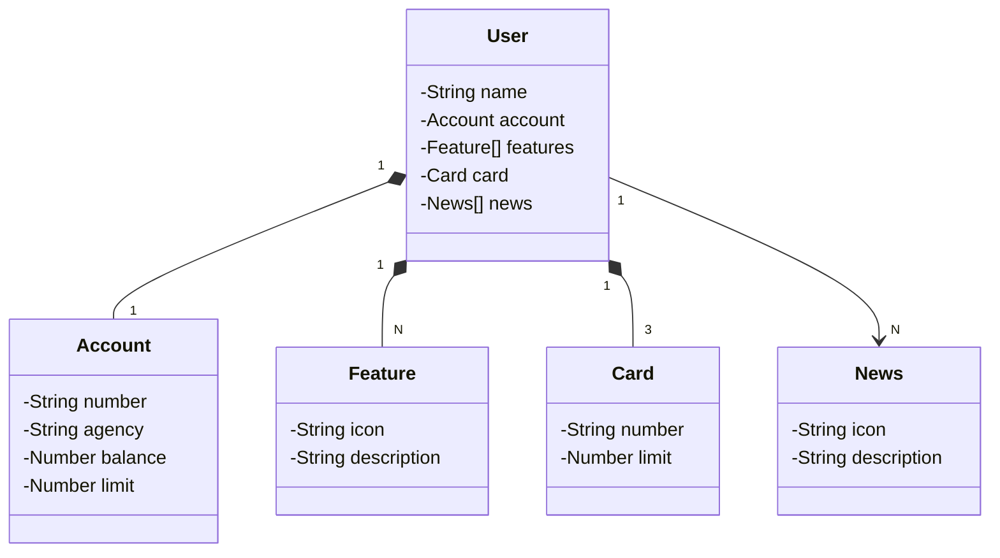

# Projeto Spring Boot Santander Dev Week

Aplicativo Java RESTful API Com Spring Boot.

## [Link do Figma](https://www.figma.com/file/0ZsjwjsYlYd3timxqMWlbj/SANTANDER---Projeto-Web%2FMobile?type=design&node-id=1421%3A432&mode=design&t=6dPQuerScEQH0zAn-1)

O Figma foi utilizado para a abstração do domínio desta API, sendo útil na análise e projeto da solução.

## [Link do Railway] (https://railway.app/)

O Railway foi usado para hopedar nossa aplicacao na nuvem

## Diagrama de Classes (Domínio da API)

